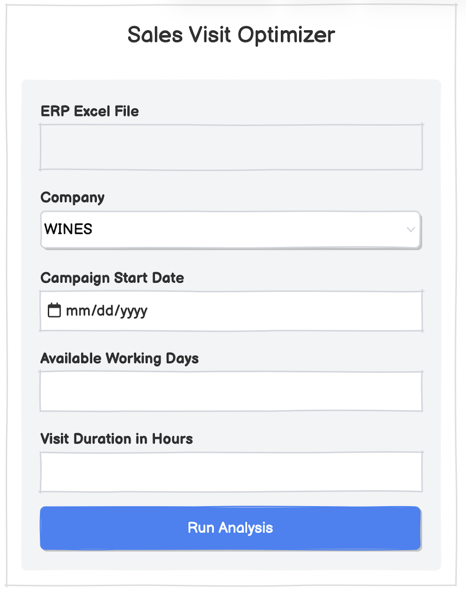
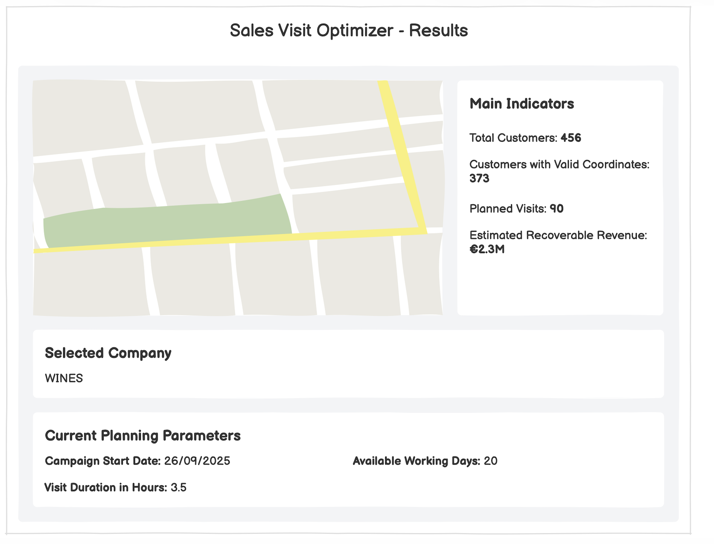
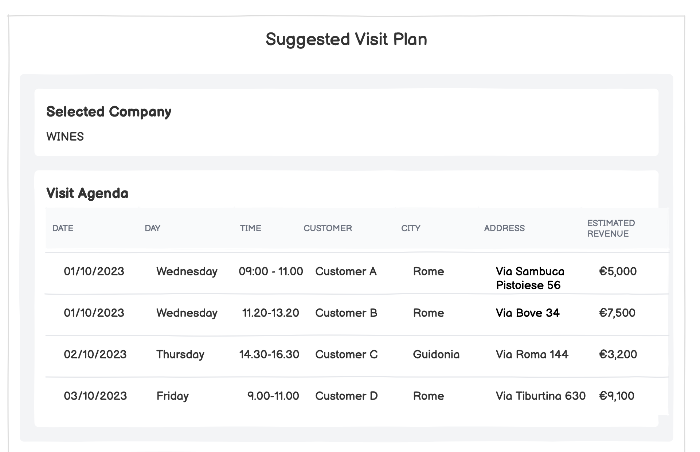

# SYSTEM DESCRIPTION:

Sales Visit Optimizer (GeoAnalytics Planner) is a web application designed for geographic customer analysis and commercial visit planning. The system processes customer datasets exported from a company ERP, containing customer locations, delivery points, sales agents, and revenue figures across federation companies.

The application allows sales managers and business analysts to upload new datasets, select a target company, configure campaign parameters (start date, available business days, expected visit duration, daily working hours, flexible lunch breaks, agent starting location, and multi-day remote trips), and visualize an optimized visit agenda alongside an interactive map and commercial KPIs. The optimization engine maximizes recovered revenue within working-day constraints (Monday-Friday, excluding Italian national holidays).

# USER STORIES:

1) As a Business Analyst, I want to upload an Excel file, so that I can work with the latest data extracted from the ERP.

2) As a Business Analyst, I want the system to detect the companies contained in the uploaded file, so that I do not have to configure them manually.

3) As a Business Analyst, I want the system to work with future ERP files having the same logical structure, so that I can reuse the application with new yearly data.

4) As a Business Analyst, I want the system to group duplicate ERP rows referring to the same delivery point, so that the same physical customer location is not considered as multiple visits.

5) As a Sales Manager, I want to select a company, so that I can analyze only the customers and revenue related to that company.

6) As a Sales Manager, I want to see the customers of the selected company on a map, so that I can understand their geographic distribution.

7) As a Sales Manager, I want to see the customer name, address and revenue on the map, so that I can understand the commercial value of each location.

8) As a Sales Manager, I want the system to geocode customer addresses, so that delivery points can be shown in their real geographic position.

9) As a Sales Manager, I want the system to report customers that cannot be geocoded, so that I know which data cannot be used for geographic planning.

10) As a Sales Manager, I want to choose the starting date of the visit campaign, so that I can plan visits for a specific commercial period.

11) As a Sales Manager, I want to define the number of working days available, so that I can test different plans.

12) As a Sales Manager, I want to define the expected duration of each customer visit, so that the visit plan reflects different scenarios.

13) As a Sales Manager, I want the system to use only working days from Monday to Friday, so that visits are not planned during weekends.

14) As a Sales Manager, I want the system to exclude Italian national holidays, so that visits are not planned on non-working days.

15) As a Sales Manager, I want the system to consider travel time between customers, so that the suggested agenda is realistic.

16) As a Sales Manager, I want the system to create a suggested sequence of customer visits, so that I can organize the working day.

17) As a Sales Manager, I want each planned visit to show date, time, customer, city, address and estimated revenue, so that I can use the agenda for daily planning.

18) As a Sales Manager, I want to see how many visits can be completed in the selected period, so that I can understand the capacity of the sales campaign.

19) As a Sales Manager, I want to see the estimated recoverable revenue of the proposed plan, so that I can understand the economic value of the campaign.

20) As a Sales Manager, I want to see how many customers are available and how many have valid geographic coordinates, so that I can understand the coverage of the analysis.

21) As a Sales Manager, I want to change the number of available days and run the analysis again, so that I can compare different what-if scenarios.

22) As a Sales Manager, I want to change the duration of a visit and run the analysis again, so that I can understand how visit duration changes the number of customers that can be visited.

23) As a User, I want clear error messages when the uploaded file cannot be processed, so that I can understand what went wrong.

## NON-FUNCTIONAL REQUIREMENTS

1. The application should be easy to use and understandable without specific technical knowledge.

2. The application should process the expected ERP dataset.

3. The application should be reusable with future ERP files having the same logical structure.

4. The application should be deployable on another computer using Docker and Docker Compose.

5. The application should provide clear error messages when the uploaded file cannot be processed.

6. The application should use real geographic coordinates for customer locations.

## LOFI MOCKUPS

### Mockup 1 - Upload and Scenario Setup

This mockup represents the initial configuration page.

It is related mainly to user stories 1, 2, 5, 10, 11 and 12.

### Mockup 2 - Results, Map and KPIs

This mockup represents the results page with the customer map and the main indicators.

It is related mainly to user stories 5, 6, 7, 18, 19, 20, 21 and 22.

### Mockup 3 - Suggested Visit Plan

This mockup represents the suggested visit agenda.

It is related mainly to user stories 16, 17, 18, 19, 21 and 22.

# CONTAINERS:

## CONTAINER_NAME: backend

### DESCRIPTION: 
The backend container manages dataset ingestion, delivery point deduplication, geocoding, business calendar evaluation, travel duration calculations, and heuristic visit route optimization.

### USER STORIES:
1, 2, 3, 4, 5, 6, 7, 8, 9, 10, 11, 12, 13, 14, 15, 16, 17, 18, 19, 20, 21, 22, 23

### PORTS: 
8000:8000

### DESCRIPTION:
The backend container provides the RESTful API services consumed by the frontend web client. It handles file parsing, coordinate caching, working calendar validation (excluding weekends and Italian national holidays), flexible lunch break scheduling, multi-day remote travel planning, and scenario result caching.

### PERSISTENCE EVALUATION
The service does not employ a relational database. Data persistence is managed via JSON-based filesystem caches mounted through Docker volumes:
- `/app/cache/geocache.json`: Stores geocoded coordinates, address normalization, and civic number matches to avoid redundant external geocoding requests.
- `/app/cache/scenarios/`: Persists pre-computed What-If optimization runs keyed by dataset hash and simulation parameters.

### EXTERNAL SERVICES CONNECTIONS
- OpenStreetMap / Nominatim API for forward address geocoding (with rate limiting and fallback mechanisms).
- Optional local Photon service container (`http://photon:2322/api`) configured via Docker Compose profile.
- OSRM (Open Source Routing Machine) public routing API for driving duration calculation, with an internal Haversine formula calculation as an automatic offline fallback.

### MICROSERVICES:

#### MICROSERVICE: visits-api
- TYPE: backend
- DESCRIPTION: REST API providing dataset processing, address geocoding, planner configuration discovery, travel time computation, and ALNS-based agenda optimization.
- PORTS: 8000
- TECHNOLOGICAL SPECIFICATION:
Developed in Python 3.11 using FastAPI and Uvicorn. Data manipulation and analytics are powered by Pandas and NumPy. Containerized via Docker with volume bindings for configuration files (`feste.config`, `planner.config`) and persistent cache directories (`/app/cache`).
- SERVICE ARCHITECTURE: 
  - `main.py`: FastAPI application entrypoint, CORS configuration, API route definitions, and scenario caching.
  - `data_processor.py`: Reads Excel/CSV files, deduplicates delivery points, orchestrates geocoding, and parses civic numbers.
  - `optimizer.py`: Bridge interface routing optimization requests into the `planning` engine.
  - `planning/facade.py`: Orchestrator of the full optimization pipeline.
  - `planning/calendar.py`: Working-day generator (Monday-Friday) reading holidays from `feste.config`.
  - `planning/feasibility.py`: Daily timeline simulation, work hour constraints, and flexible lunch break slot insertion.
  - `planning/clustering.py`: Geographic clustering and daily route partitioning.
  - `planning/routing.py`: TSP sequencing (Nearest Neighbor / 2-Opt) using OSRM and Haversine fallback.
  - `planning/alns.py`: Adaptive Large Neighborhood Search metaheuristic maximizing recovered revenue.
  - `planning/trasferte.py`: Detection and scheduling of multi-day remote customer trips with overnight hotel stays.
  - `planning/config.py`: Dynamic loader for `planner.config` working hour parameters.
  - `planning/serializer.py`: Formats schedule records and summary KPIs for client consumption.

- ENDPOINTS:

	| HTTP METHOD | URL | Description | User Stories |
	| ----------- | --- | ----------- | ------------ |
	| POST | `/api/upload` | Ingests Excel/CSV file, detects federation companies, groups duplicate delivery points, and returns available companies | 1, 2, 3, 4, 23 |
	| GET | `/api/geocode` | Geocodes a street address with civic number parsing and local JSON cache lookup | 8, 9 |
	| GET | `/api/config` | Retrieves default work schedule, lunch window, and visit duration parameters from planner.config | 10, 11, 12, 13, 14 |
	| GET | `/api/travel-time` | Computes driving duration and distance between two addresses and checks travel thresholds | 15, 16 |
	| POST | `/api/analyze` | Executes scenario optimization considering working days, lunch breaks, and remote trips, returning KPIs, map coordinates, and visit agenda | 4, 5, 6, 7, 8, 9, 10, 11, 12, 13, 14, 15, 16, 17, 18, 19, 20, 21, 22, 23 |
	| GET | `/docs` | Exposes interactive Swagger/OpenAPI documentation for testing and verification | 23 |

## CONTAINER_NAME: frontend

### DESCRIPTION: 
The frontend container hosts the client-side user interface of Sales Visit Optimizer, serving static web assets through an Nginx web server.

### USER STORIES:
1, 2, 5, 6, 7, 8, 9, 10, 11, 12, 13, 14, 15, 16, 17, 18, 19, 20, 21, 22, 23

### PORTS: 
8080:80

### DESCRIPTION:
Nginx web server hosting the Single Page Application, providing scenario configuration forms, interactive Leaflet mapping, commercial KPI cards, and agenda timelines. It acts as a reverse proxy for `/api/` requests forwarding to the backend container.

### PERSISTENCE EVALUATION
Stateless web client. Dataset selections and scenario parameters are maintained in client memory during the browser session.

### EXTERNAL SERVICES CONNECTIONS
- OpenStreetMap and CartoDB tile servers for Leaflet basemaps.
- Leaflet.js CDN for interactive mapping scripts and styles.

### MICROSERVICES:

#### MICROSERVICE: web-interface
- TYPE: frontend
- DESCRIPTION: Responsive Single Page Application providing scenario setup, geospatial visualization, and visit schedule inspection.
- PORTS: 80 inside container, exposed as port 8080 on the host.
- TECHNOLOGICAL SPECIFICATION:
HTML5, Vanilla CSS3 (custom glassmorphism dark theme design system), Vanilla JavaScript (ES6+), Leaflet.js library, served by Nginx on Alpine Linux.
- SERVICE ARCHITECTURE: 
  - `index.html`: Web page layout containing the parameter sidebar, summary KPI cards, Leaflet map viewport, and agenda schedule table.
  - `style.css`: Theme styles, responsive grid, glassmorphism UI tokens, and interactive widgets.
  - `script.js`: DOM event handling, REST API communication, Leaflet marker management, and dynamic KPI/table updates.
  - `nginx.conf`: Nginx web server configuration with `/api/` reverse-proxy routing to `http://backend:8000/api/`.

- PAGES:

	| Name | Description | Related Microservice | User Stories |
	| ---- | ----------- | -------------------- | ------------ |
	| `index.html` | Interactive dashboard for uploading ERP datasets, setting scenario parameters (days, visit duration, work/lunch hours, remote trips, start address), viewing the customer map, checking KPIs, and browsing the chronological visit agenda | visits-api | 1, 2, 5, 6, 7, 8, 9, 10, 11, 12, 13, 14, 15, 16, 17, 18, 19, 20, 21, 22, 23 |
